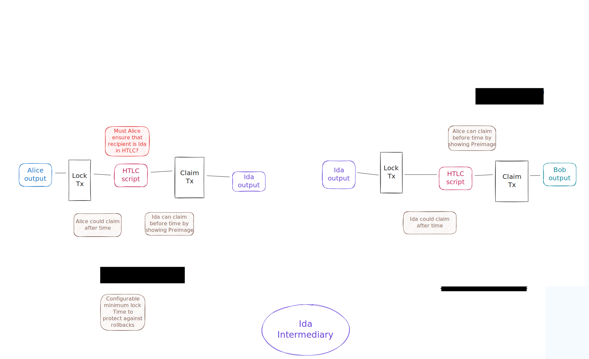
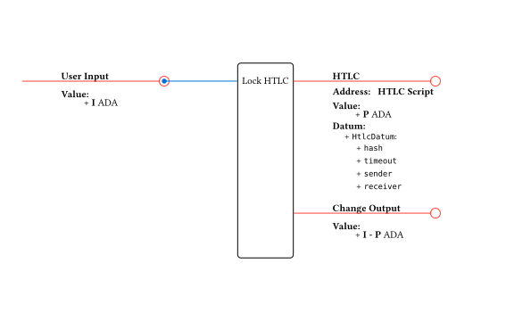
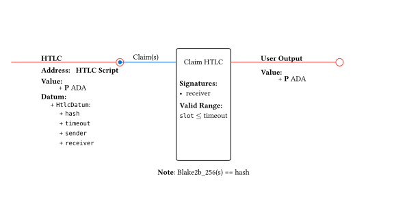
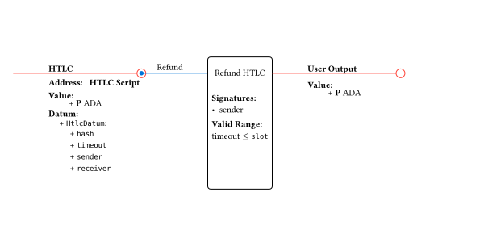

# Milestone 1

Consists of two parts
1. HTLC prototype of payment between two L2s
2. Transaction design for ad-hoc ledgers

## HTLC payment

Example workflow of a payment of some `$USDM` from `Alice` to `Bob` via one intermediary `Ida` using Hash-Time-Locked Contracts (HTLC).

 The topology of the involved L2s is not further specified here, but could be for example two Hydra heads between `Alice-Ida` and `Ida-Bob`, or a two-party head beween `Alice-Ida` and both, `Ida` and `Bob` being participants of a Midgard optimistic rollup. Even multi-party heads where multiple intermediaries could share the collateral across multiple HTLC outputs are thinkable, but that would need further investigation how we can guarantee collateralization across multiple outputs.

## HTLC Design

The HTLC is implemented as a single validator, with two possible redeemers, `Claim` and `Refund`. No validation is run during the `Lock` operation.

### UTxOs Specification

#### HTLCUtxo

> **Address**
>
> - Script address

> **Datum**
>
> - hash: ByteString
> - timeout: PosixTime
> - sender: VerificationKeyHash
> - receiver: VerificationKeyHash

> **Value**
>
> - min ADA
> - offered tokens

### Transactions

#### Lock Funds

Creates an `HTLCUtxo` containing the offered tokens. The datum specifies the sender and receiver Verification keys for future authetication, as well as the timeout in posix time and the hash of the secret needed to claim the funds.

In step 1 of our example, Alice would execute this transaction and specify herself as the sender, Ida as the receiver, a timeout sufficiently in the future and the hash shared by Bob. In step 3, Ida would execute this transaction and specify themselves as the sender, Bob as the receiver, a timeout slightly lower than the one Alice specified and the same hash used in step 1.

The lower timeout is needed to avoid a situation where Bob claims the funds in Head B and Ida is unable to claim their share in Head A.

#### Claim Funds

Consumes a `HTLCUtxo` with the `Claim` redeemer, providing the preimage of the stored hash. This transaction must be submited before the timeout and must be signed by the receiver.

In step 4, Bob uses the preimage that they generated in step 0 to claim the funds. In step 6, Ida uses the preimage that they learned from Bob's transaction to unlock the funds locked by Alice.

#### Refund

Consumes a `HTLCUtxo` with the `Refund` redeemer. This transaction must be submited after the timeout and be signed by the sender.

## Ad-hoc ledgers

The [State Machines across Isomorphic Layer 2 Ledgers](https://eprint.iacr.org/2023/1027.pdf) paper describes a solution for implementing atomic transactions performed across multiple L2 ledgers. By the paper, this is achieved by the verify→perform mechanism.

### The verify→perform mechanism

Lets analize a simple example with just two Hydra heads as the L2s.

Let `A`, `B` be Hydra heads. An atomic transaction is a process involving a sequence of two transactions per head, named `verify``X` and `perform``X` for head `X ∈ {A, B}`. The goal would be to transfer assets from `A` to `B`, avoiding inconsistent and non-reversible states.

The purpose of `verify``X` is to “simulate” the corresponding action to be performed in X. If `verify``X` succeeds for each X, it means that `perform``X` is safe to execute.

In simple terms, we first verify that the action to be taken in each head is doable (inputs could be spent, minting/burning validates successfully if any), and only then are the actions performed in each head. If `perform``X` for each `X` is successful, then the assets transfer from `A` to `B` is completed.

But, how to verify a future `perform` without executing it?
In the `verify` step, the protocol does not directly produce the final outputs of the transfer. Instead:

- The full body of the intended `perform` transaction (the "original transaction") is embedded in the `verify` transaction’s somewhere (or maybe a hash of it).

- `verify` ensures that its own inputs match those expected by the original transaction, and that all validation conditions (scripts, minting/burning policies) to produce the outputs (held in the embedded transaction) can be satisfied.

- Because outputs are not yet created, irreversible actions like actual burning or final distribution do not happen at this stage.

- Once `verify` has succeeded in both heads, the `perform` transaction does what the stored original body says, burns any temporary tokens, and creates the final outputs exactly as pre-agreed.

This mechanism implies that `verify` should be reversible. For example, transferring USDM from `A` to `B` without an intermediary liquidity provider involves burning them from `A` and minting them in `B`. If `verify``A` succeeds and `verify``B` doesn’t, we must be able to recover the USDM in `A`.

This implies that NFTs are not considered in this mechanism. Only for ADA and fungible tokens. Extra policy engineering is needed to support NFTs.

In scenarios where one of the parties in charge of doing `perform` hangs out the protocol flow by not doing it, a *merge-transaction* is needed to resolve disputed UTxOs, supported by other safety measures like collateralization.

The UTxOs subject to the verify→perform mechanism are called *wrapped UTxOs*, whose set defines the ad-hoc ledger `Lₚ`. Each head will contain a replica of the `Lₚ`. For the given use case of `A`→`B` transfer

- Replica `R₀` in `A` contains `Lₚ`-wrapped UTxOs that include the actual asset being moved. These UTxOs are locked under the `Lₚ` validator.
- Replica `R₁` in `B` contains `Lₚ`-wrapped UTxOs that include the intermediary collateral. Locked under the same `Lₚ` validator.

Atomicity is enforced by making every `Lₚ` state change happen on both replicas (or none), so those two local views stay semantically equal even though the concrete UTxOs represent different things (assets to move on `A` vs collateral on `B`). In other words, both replicas UTxO set being semantically equivalent is the invariant that ensures atomicity. Divergent replicas states mean a liquidity trap.

The entities in charge of coordination of the verify→perform sequence on both heads is called *intermediaries*. They co-sign reversible verify transactions to confirm that inputs, witnesses, and policies are valid without committing to irreversible changes.

Intermediaries generate a pre-collected aggregate signature  –a single signature assembled from all intermediaries’ keys– which will later authorize the irreversible perform transactions.

Intermediaries also post _collateral_, locked under the `Lₚ` validator at head `B`, equalling the value of the secured wrapped UTxOs at head `A`, needed for asset transfers. In a simple case of `A`→`B` transfer with just one intermediary, the intermediary posts the collateral in `R₁` replica and receives the same amount in `R₀` replica.

### How to `verify` a future `perform` without executing it?

The verify step stages a reversible transaction that proves the perform step can succeed. This is achieved by:

- Collecting all relevant inputs: wrapped UTxOs from both replicas (assets in Head A, collateral in Head B).
- Running all on-chain validation scripts: minting/burning, spending conditions, exactly as they would be in perform, but with outputs locked to an intermediate state rather than the final recipient.
- Minting temporary proof tokens: these attest that the inputs passed validation and can be spent in perform.
- No irreversible actions: assets are not actually moved to the destination or destroyed. Instead, they are locked in a way that can be undone if the other head’s verify fails.

This process guarantees that if both heads succeed in verify, the perform transactions can later be executed with no risk of failure, while still allowing reversibility if one side cannot verify.

### Use case

Transfer from User 1 in Head A → User 2 in Head B (with intermediaries set 𝙄)

#### Participants
- User 1 in Head A: sender of asset X
- User 2 in Head B: receiver of asset X
- 𝙄 = {I₁, …, Iₖ}, k ≥ 2: intermediaries present in both heads; hold collateral; co-sign atomic steps

#### Wrapped UTxO Datum Specification
- owner (Address)
- Kᵢ: aggregated public key of all intermediaries. For enforcing multisig control from the intermediary set.
- nonce (Integer): random value generated at setup to uniquely bind the UTxO to a specific ad-hoc ledger instance.
- perform tx body hash (Hash): hash of expected `perform` tx body to be executed after `verify`.

#### Step-by-Step
- Wrap assets to transfer + collateral
  - A: User 1 locks asset X in `Lₚ` script → creates wrapped UTxO in replica `R₀`.
  - B: Each Iᵢ locks their share of collateral in `Lₚ` script → creates wrapped UTxOs in replica `R₁`.

- `verify``A` (Head A)
  - Consumes User 1's wrapped UTxO, produces a staging UTxO (same assets, reversible, with proof of validity).
  - Intermediaries multisig is performed.

- `verify``B` (Head B)
  - Consumes collateral UTxOs, produces staging collateral UTxO (same assets, reversible, with proof of validity).
  - Intermediaries multisig is performed.

- Collect perform signatures
  - Each Iᵢ agree and sign both `perform``A` and `perform``B` tx bodies.

- `perform``A` (Head A)
  - Finalizes burn/removal/transfer of asset in `A`.

- `perform``B` (Head B)
  - Delivers assets to User 2 in `B`.
