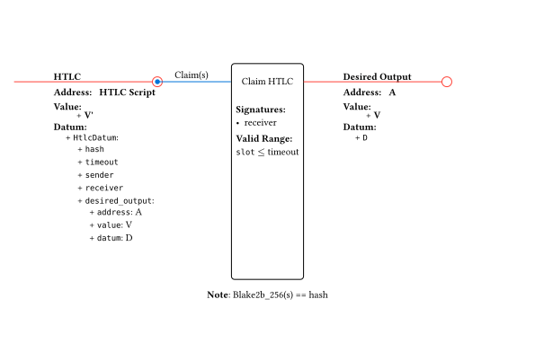
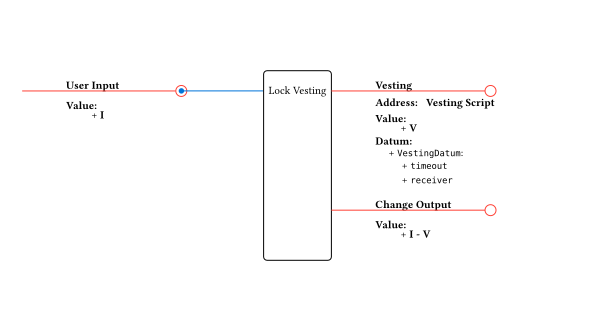
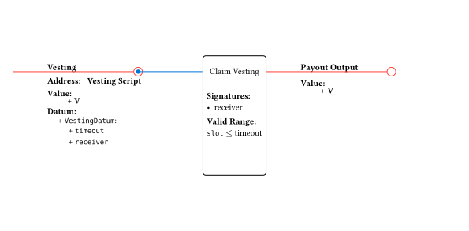
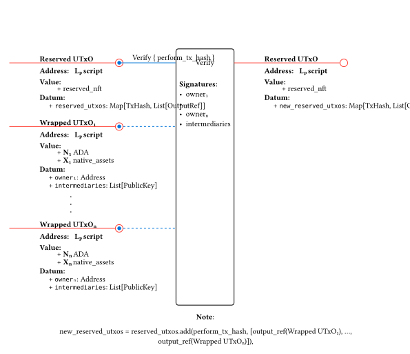
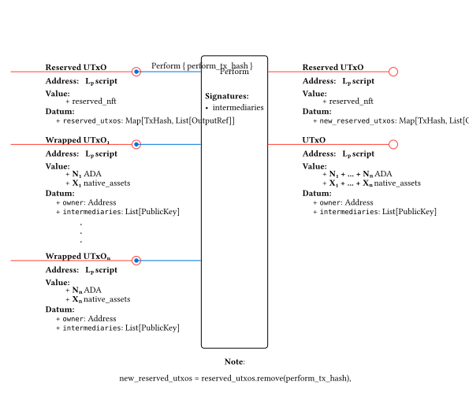
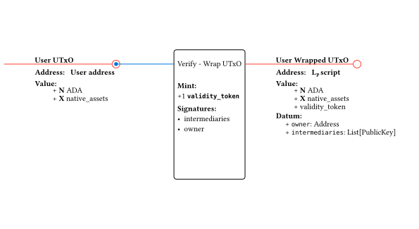
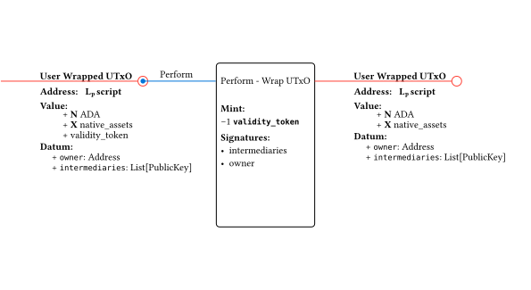

# Milestone 2

Consists of two parts:
1. HTLC + Vesting implementation
2. Ad-hoc ledgers `verify-perform` mechanism PoC

## HTLC + Vesting implementation

For this second milestone, we extended the HTLC contract implemented in MS1. By adding output validation, we allow the HTLC to enforce the creation of smart contract UTxOs during the claim operation. We also implemented a very simple vesting contact to use as an example of inter-head smart contract interaction.

The canonical use case for HTLCs, explained in MS1, require two parties interested in executing a transaction (Alice and Bob in our case). This way, the party that will receive the funds is in charge of generating the preimage and sharing the hash, the other party creates the HTLC. This dinamic is important, if there's only a single party interested in making the transaction, the flow breaks, so, in order to maintain it, the example we choose is a vesting contract, where Alice is sending funds to Bob, but they will be unlocked at a future time. Bob can share the preimage once the funds are guaranteed by the HTLC 2.0 contract to be sent to the vesting address with the appropiate timeout.

### HTLC 2.0 Improvements

We'll list the changes made from the HTLC desing in MS1, anything not mentioned in this document is the same as the previous version, which you can read more here (TODO: Add link)

The first change was to add a new data type called `DesiredOutput`, this type represents everything we want to specify as the desired output when claiming the HTLC, including a non-opaque representation of a Value and an optional datum (if a datum is included, we force it to be Inline).

#### UTxO Specification

> **Datum**
>
> - hash: ByteString
> - timeout: PosixTime
> - sender: VerificationKeyHash
> - receiver: VerificationKeyHash
> - desired_output: DesiredOutput
>
> **DesiredOutput**
>
> - address: Address
> - value: Pairs<PolicyId, Pairs<AssetName, Int>>
> - datum: Option<Data>

#### HTLC Transactions

##### Claim funds

Consumes a `HTLCUtxo` with the `Claim` redeemer, providing the preimage of the stored hash. This transaction must be submited before the timeout, signed by the receiver and create the desired_output.

### Vesting Contract

The vesting contract is a single validator with a single operation, "Claim".

#### UTxOs Specification

##### VestingUTxO

> **Address**
>
> - Script address

> - **Datum**
>
> - timeout: PosixTime
> - receiver: ByteArray

> **Value**
>
> - min ADA
> - offered tokens

#### Vesting Transactions

##### Lock Funds

Creates a `VestingUTxO` containing the offered tokens. The datum specifies the timeout in posix time from when the tokens become available to claim and the receiver that can claim them. This transaction has no validation, so the fields of the datum must be carefully considered. An invalid pubkeyhash or a timeout on the far future might make the UTxO unspendable.

##### Claim Funds

Consumes a `VestingUTxO`. This transaction should be submitted after the deadline and signed by the receiver.

### Drawbacks of this design

As mentioned in the introduction, HTLCs still require two parties to be interested in the transaction taking place. For single party examples, like Alice wanting to place a bet in a lotery happening in another head, the preimage and hash management becomes fuzzy. This issue is demonstrated further when you take into account that Alice has no way to ensure that the HTLC UTxO that Ida created in Head B has the correct desired_output. For a single party example, this makes it a fully trusting protocol. For the dual party example, this is still not ideal. Bob could collude with Ida to make the timeout of the vesting UTxO shorter, or delete it altogether. A potential solution would involve making the desired_output field part of the hash, so the claim becomes impossible if this value is tampered with.

This solution sounds ideal, but the issue now becomes that the desired_output is not the same in Head A a in Head B. In Head B we want to create the vesting UTxO in the name of Bob for a future timeout, but in Head A, Ida would want to recover the assets as soon as possible without waiting and certainly without having to get Bob's signature.

This design constraints will be discussed in more detail once we start to compare HTLCs with the Ad-hoc ledger approach.

## Ah-hoc ledger `verify-perform` mechanism PoC

The main challenge is to assess the feasibility of the mechanism by implementing a first version.

We'll implement the mechanism as part of a script that UTxOs from the involved L2s will interact with. The script will be used to `verify` and `perform` the transactions across the L2s.

The mechanism is comprised of the following operations:
- `verify`: verify a future `perform` transaction in this ledger, using wrapped UTxOs.
- `perform`: perform the already-verified transaction.

### Contract Design - Version 1

#### Wrapped UTxOs

L2 users will send UTxOs to the Lp script address for making them available in the ad-hoc ledger.

- Address: Lₚ script
- Value: any
- Datum:
  - owner: Address
  - intermediaries: List[PublicKey]

#### Reserved UTxO

The state UTxO used to store the reserved wrapped UTxOs. Its NFT will be minted by the `mint` purpose of the Lp script.

- Address: Lₚ script
- Value: 1 NFT
- Datum:
  - reserved_utxos: Map[TransactionHash, List[OutputRef]]

#### Lₚ script

- Spend purpose redeemers:
  - Verify
  - Perform

- Mint purpose redeemers:
  - Data: for minting the Reserved UTxOs

- No other purposes allowed

#### Operations overview

The `verify` operation will mark some specific UTxOs as **reserved** for a `perform` transaction, while disallowing the usage for other `verify` operations. The marked UTxOs list will be stored in the datum of a unique "state UTxO" for the ad-hoc ledger. By off-chain mechanisms, the UTxOs will be tagged with the `perform` transaction hash, and a set of privileged participants will cosign the transaction as a way to guarantee some level of security.

The `perform` operation will consume their reserved wrapped UTxOs, and validate its hash against the tag of those UTxOs.

As stated in the `verify-perform` mechanism description for ms1 deliverable, each L2s replica of the ad-hoc ledger must be semantically equivallent i.e. same UTxO set except their addresses, for ensuring no liquidity traps. This consistency, along with the correct ordering of the operations for atomicity, is ensured by the intermediaries cosigning the `verify` and `perform` transactions in each L2 replica.

#### Restrictions, Notes & Future Improvements

- Any piece of data that is needed for the `perform` operation could not be related to the `verify` operation in any way, since we need to calculate the `perform` tx hash _before_ building the `verify` transaction.

This happens because if we relate a verify-perform pair by the `perform` transaction hash, we need to build the `perform` transaction _before_ building the verify tx. This implies that the reserved UTxOs could not be spent in both transactions, nor the reserved UTxO datum could be updated in both transactions.

Even more, reserved UTxO datum could not be updated in the `verify` transaction _only_ because it must be referenced in the `perform` transaction with the `verify` tx hash, which is unknown at the time of building the `perform` transaction body.

So, the core problem to solve is how to on-chain relate `verify` and `perform` transactions in order to ensure atomicity and consistency, taking into account the previous constraints.

- The intermediaries might be a parameter of the Lₚ validator instead of being part of the reserved UTxOs datum?

- How to relate on-chain Lₚ scripts from different heads? We might need a unique identifier mechanism, as proposed in the paper.

- How to prevent intermediaries from cheating by doing verify-perform in only one head, whilst doing nothing in the other head? This might be a concern for the _dispute mechanism_ proposed in the paper, and subject to further research in a coming milestone.

### Contract Design - Version 2

We need a more flexible version in terms of the constraints regarding the relationship between the `verify` and `perform` transactions. So, we'll do a very simple version that we're sure that works, and add constraints in later versions for iteratively adding security and decentralization guarantees.

In this version, the `verify` will consume the UTxOs meant to be inputs to the `perform` transaction, add them a specific "validity token" that could be recognized by the `perform` transaction. Then, `perform` will consume the UTxOs and burn those tokens.

This way, we offload to the intermediaries the responsability of doing the proper inspection and execution of both the `verify` and `perform` transactions. Later version must favour on-chain code over intermediaries supervision.

#### Wrapped UTxOs

Same as Version 1.

#### Lₚ script

- Spend purpose redeemers:
  - Verify
  - Perform

- Mint purpose redeemers:
  - MintVerified: for minting validity tokens. This tokens "reserve" the UTxOs for a future `perform` transaction.
  - BurnVerified: for burning validity tokens.

- No other purposes allowed

#### Operations overview

The `verify` operation will consume the UTxOs meant to be inputs to the `perform` transaction, add them a specific "validity token" that could be recognized by the `perform` transaction. Then, `perform` will consume the UTxOs and burn those tokens.

Let's consider the example of applying the mechanism for wrapping a UTxO.

`verify` consumes the User UTxO and adds a validity token to it, meaning is reserved for the `perform` transaction.

Then, `perform` consumes the User Wrapped UTxO and burns the validity token, meaning the UTxO is available within the Lₚ script for other operations. These other operations must also use this mechanism to ensure atomicity.

#### Notes & Future Improvements

- There's no constraint that explicitly relates a pair of `verify` and `perform` transactions. A non-scalable approach might be to restrict the mechanism to only one `verify` happening at a time, with each `verify` having a very short timeout for the `perform` transaction to be executed. Resolving this on-chain is quite neccessary for being a robust mechanism.

- Also, the constraint of actually doing the `perform` that the intermediaries and owners agreed about in `verify` is not enforced by this implementation. This is delegated to the good faith of intermediaries. We must tighten this solution to match the requirement in a future enhancement as well.

- Add unique identifier mechanism to relate the "same" Lₚ script from different heads.

- Add collateral slashing tracking between intermediaries, for answering: how much of the value of each collateral UTxO is from each intermediary?

### Contract Design - Version 3

A middle-ground between Version 1 and Version 2.

For solving the problem posed by Version 1 of circularity happening by relating a verify-perform pair with the `perform` transaction hash, we must break it. This can be achieved by
  - labeling the reserved inputs with a token, as in Version 2. This avoids `verify` double-spending as well.
  - create a spec for the expected `perform` transaction outputs.

The outputs spec definition and usage is challenging, but we can think of using the transaction redeemers to pass that information.

- pass by redeemer the expected `perform` outputs spec to `verify`. `verify` collects inputs, validates that is possible to produce the `perform` outputs from them, and reserves those inputs by attaching a token (as in Version 2).
- `perform` just collects those reserved inputs, burn their marker tokens and produces the outputs.

Then, there's still an issue to resolve: how do we ensure that perform actually consumes the `verify`-marked inputs and produces the expected outputs?

A possible solution might be to produce a hash from the outputs spec, and use it as the token name of the `verify`-minted tokens, which in turn are attached to the marked inputs. Then, in `perform` we burn those tokens and validate that hashing the produced outputs matches the name of the tokens being burnt. This way, we relate a pair of verify-perform while avoiding clashes between distinct `verify`'s.
