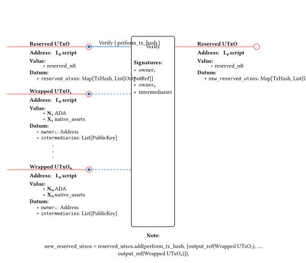
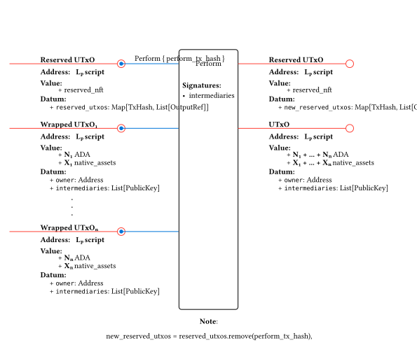
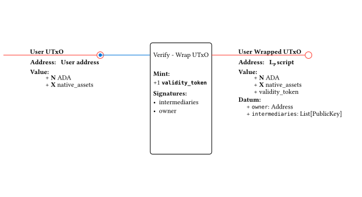
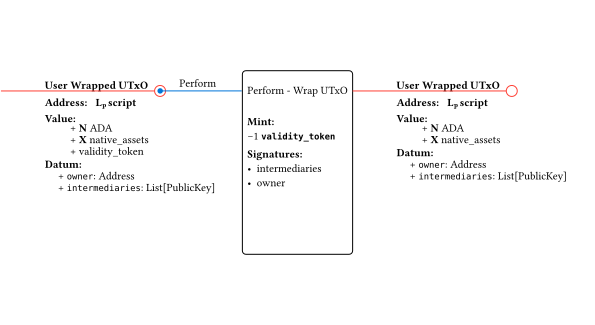

# Milestone 2

Consists of two parts:
1. HTLC + Vesting implementation
2. Ad-hoc ledgers `verify-perform` mechanism PoC

## Ah-hoc ledger `verify-perform` mechanism PoC

The main challenge is to assess the feasibility of the mechanism by implementing a first version.

We'll implement the mechanism as part of a script that UTxOs from the involved L2s will interact with. The script will be used to `verify` and `perform` the transactions across the L2s.

The mechanism is comprised of the following operations:
- `verify`: verify a future `perform` transaction in this ledger, using wrapped UTxOs.
- `perform`: perform the already-verified transaction.

### Contract Design - Version 1

#### Wrapped UTxOs

L2 users will send UTxOs to the Lp script address for making them available in the ad-hoc ledger.

- Address: Lₚ script
- Value: any
- Datum:
  - owner: Address
  - intermediaries: List[PublicKey]

#### Reserved UTxO

The state UTxO used to store the reserved wrapped UTxOs. Its NFT will be minted by the `mint` purpose of the Lp script.

- Address: Lₚ script
- Value: 1 NFT
- Datum:
  - reserved_utxos: Map[TransactionHash, List[OutputRef]]

#### Lₚ script

- Spend purpose redeemers:
  - Verify
  - Perform

- Mint purpose redeemers:
  - Data: for minting the Reserved UTxOs

- No other purposes allowed

#### Operations overview

The `verify` operation will mark some specific UTxOs as **reserved** for a `perform` transaction, and also disallow the usage for other `verify` operations. The marked UTxOs list will be stored in the datum of a unique "state UTxO" for the ad-hoc ledger. By off-chain mechanisms, the UTxOs will be tagged with the `perform` transaction hash, and a set of privileged participants will cosign the transaction as a way to guarantee some level of security for the mechanism.

The `perform` operation will consume their reserved wrapped UTxOs, and validate its hash against the tag of those UTxOs.

As stated in the `verify-perform` mechanism description for ms1 deliverable, each L2s replica of the ad-hoc ledger must be semantically equivallent i.e. same UTxO set except their addresses, for ensuring no liquidity traps. This consistency, along with the correct ordering of the operations for atomicity, is ensured by the intermediaries cosigning the `verify` and `perform` transactions in each L2 replica.

#### Research & Implementation Notes

- Any piece of data that is needed for the `perform` operation could not be related to the `verify` operation in any way, since we need to calculate the `perform` tx hash _before_ building the `verify` transaction.  
This implies that the reserved UTxOs could not be spent in both transactions, nor the reserved UTxO datum could be updated in both transactions. Even more, reserved UTxO datum could not be updated in the `verify` transaction _only_ because it must be referenced in the `perform` transaction with the `verify` tx hash, which is unknown at the time of building the `perform` transaction body.  
So, the core problem to solve is how to on-chain relate `verify` and `perform` transactions in order to ensure atomicity and consistency, taking into account the previous constraints.

- The intermediaries might be a parameter of the Lₚ validator instead of being part of the reserved UTxOs datum?

- How to relate on-chain Lₚ scripts from different heads? We might need a unique identifier mechanism, as proposed in the paper.

- How to prevent intermediaries from cheating by doing verify-perform in only one head, whilst doing nothing in the other head? This might be a concern for the _dispute mechanism_ proposed in the paper, and subject to further research in a coming milestone.

### Contract Design - Version 2

We need a more flexible version in terms of the constraints regarding the relationship between the `verify` and `perform` transactions. So, we'll do a very simple version that we're sure that works, and add constraints in later versions for iteratively adding security and decentralization guarantees.

In this version, the `verify` will consume the UTxOs meant to be inputs to the `perform` transaction, add them a specific "validity token" that could be recognized by the `perform` transaction. Then, `perform` will consume the UTxOs and burn those tokens.

This way, we offload to the intermediaries the responsability of doing the proper inspection and execution of both the `verify` and `perform` transactions. Later version must favour on-chain code over intermediaries supervision.

#### Wrapped UTxOs

Same as Version 1.

#### Lₚ script

- Spend purpose redeemers:
  - Verify
  - Perform

- Mint purpose redeemers:
  - VerifyMint: for minting validity tokens. This tokens "reserve" the UTxOs for a future `perform` transaction.
  - PerformBurn: for burning validity tokens.

- No other purposes allowed

#### Operations overview

The `verify` operation will consume the UTxOs meant to be inputs to the `perform` transaction, add them a specific "validity token" that could be recognized by the `perform` transaction. Then, `perform` will consume the UTxOs and burn those tokens.

Let's consider the example of applying the mechanism for wrapping a UTxO.

`verify` consumes the User UTxO and adds a validity token to it, meaning is reserved for the `perform` transaction.

Then, `perform` consumes the User Wrapped UTxO and burns the validity token, meaning the UTxO is available within the Lₚ script for other operations. These other operations must also use this mechanism to ensure atomicity.

#### Notes & Future Improvements

- There's no constraint that explicitly relates a pair of `verify` and `perform` transactions. A non-scalable approach might be to restrict the mechanism to only one `verify` happening at a time, with each `verify` having a very short timeout for the `perform` transaction to be executed.

- Add unique identifier mechanism to relate the "same" Lₚ script from different heads.

- Add collateral slashing tracking between intermediaries: how much of the value of each colalteral UTxO is from each intermediary?
