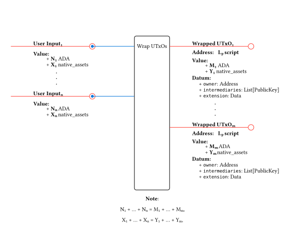

# Milestone 2

Consists of two parts:
1. HTLC + Vesting implementation
2. Ad-hoc ledgers `verify-perform` mechanism PoC

## Ah-hoc ledger `verify-perform` mechanism PoC

The main challenge is to assess the feasibility of the mechanism by implementing a first version.

We'll implement the mechanism as part of a script that UTxOs from the involved L2s will interact with. The script will be used to `verify` and `perform` the transactions across the L2s.

The mechanism is comprised of the following operations:
- `wrap`: wrapping a UTxO from the L2 means to make it available in the ad-hoc ledger
- `verify`: verify a future `perform` transaction in this ledger, using wrapped UTxOs.
- `perform`: perform the already-verified transaction.
- `unwrap`: unwrap a UTxO from the ad-hoc ledger means to make it available in the L2.

### Contract Design

#### Wrapped UTxOs

L2 users will send UTxOs to the Lp script address for making them available in the ad-hoc ledger.

- Address: Lp script
- Value: any
- Datum:
  - owner: Address
  - intermediaries: List[PublicKey]
  - extension: Data

#### Reserved UTxO

The state UTxO used to store the reserved wrapped UTxOs. Its NFT will be minted by the `mint` purpose of the Lp script.

- Address: Lp script
- Value: 1 NFT
- Datum:
  - reserved_utxos: Map[TransactionHash, List[OutputRef]]

#### Lp script

- Spend purpose redeemers:
  - Verify
  - Perform
  - Unwrap

- Mint purpose redeemers:
  - Data: for minting the Reserved UTxOs

- No other purposes allowed

#### Operations overview

The `wrap` operation will not be on-chain validated for a first implementation version. It will just boil down to simply paying a UTxO with a well-formed datum to the script address.

The `verify` operation will mark the wrapped UTxOs as **reserved** for a specific `perform` transaction, and also disallow the usage for other `verify` operations. The marked UTxOs list will be stored in the datum of a unique "state UTxO" for the ad-hoc ledger. By off-chain mechanisms, the wrapped UTxOs will be tagged with the `perform` transaction hash, and a set of privileged participants will cosign the transaction as a way to guarantee some level of security for the mechanism.

The `perform` operation will consume their reserved wrapped UTxOs, and validate its hash against the tag of those UTxOs.

The `unwrap` operation will unwrap the UTxOs from the ad-hoc ledger and make them available in the L2.

The operation for creating the state UTxO will be on the validator's `mint` purpose.
