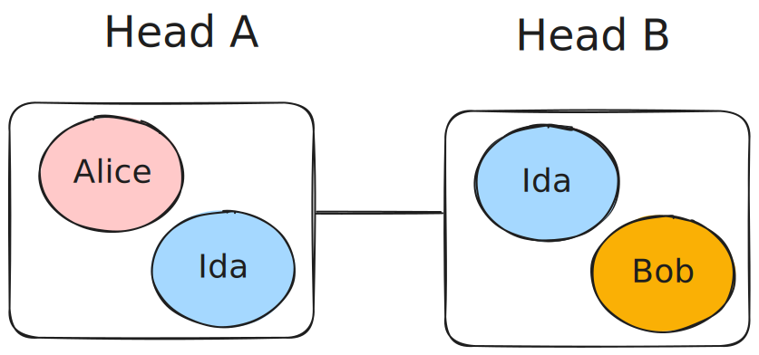
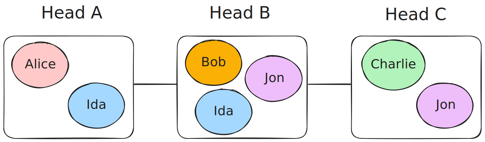
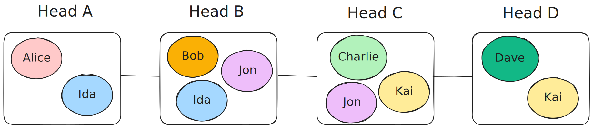
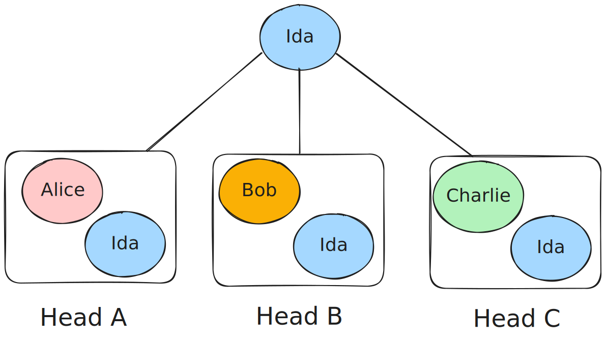
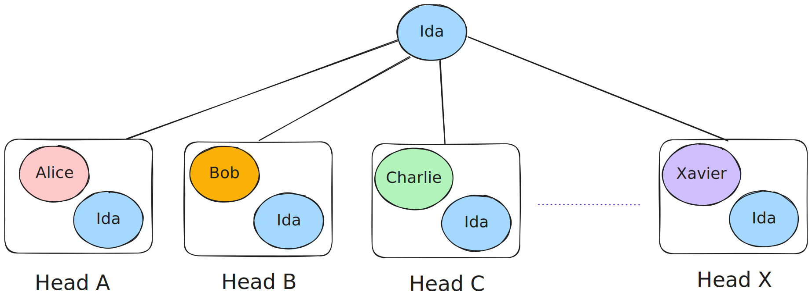

# Milestone 3

Consists of two parts

1. Multi-L2 topologies
2. Model efficiency comparisson and performance

In this third milestone we are looking at how we can extend the system we've built to more than two L2 ledgers. We look into multiple possible topologies and compare how different configurations of topologies and models perform.

## Topologies Explanation

### Two-heads topology

The two-heads topology is the simplest one, it consists of two heads, each with two participants.

The use case for this topology is HTLC-based payments between two parties from different heads, with some party acting as intermediary (present in both heads) i.e. single hop payment.

### Single-path topology

The single-path topology is the natural expansion of the two-heads topology, for each new participant a new head is added with a new intermediary that "joins"[^1] the previous end head as well. In this manner, each user can interact directly with at most two other users. Each "middle" head now has three participants, one user and two intermediaries while both ends of the chain have only two participants. Using this topology payments might require up to M-1 hops for M heads, with the benefit of splitting the liquidity requirements between multiple intermediaries.

The single path topology for three and four heads would look like this:

And it's easy to see that it can be expanded indefinitely.

While this expansion seems natural, it comes with some pretty big drawbacks. Mainly, each new user increases both median and max path lenghts, and at some point the cost and latency would become so big that it would be better to do payments through the L1 instead. Also, having users in a hydra head along a payment path, would require those users to be online and to sign the corresponding snapshots even if they are not part of the deal. Let's see how we can improve on those two points.

[^1]: As we are talking about static topologies, participants don't join already running networks. Rather they join during a "planning" phase where heads and intermediaries are being designed.

### Hub-and-spoke topology

Realizing that we need to isolate each user on it's own path, we can experiment with another common topology, the hub-and-spoke topology. In this topology, a single intermediary acts as hub for all users. Creating only pair wise heads, and allowing any payments to be achieved with a single hop. For each new participant a new head is added with the intermediary in it.

Hub and spoke with three or X heads, here we represent Ida outside the heads to show that all payments flow trough them in a single hop

As mentioned before, all payments in this topology are single hop payments, and we can see that is the case no matter how many users we add. The main drawback of this design now becomes liquidity, we need a single intermediary to achieve this level of transaction efficiency, but this carries a high liquidity requirement for the intermediary.

## Model efficiency

Now that we presented some common topologies, we will compare the theoretical efficiency of the adhoc-ledger design vs point-to-point transactions and the implemented HTLC system across multiple dimesions such as:

* Transaction cost/count
* Liquidity constraints

### Transaction cost

Transaction costs can be divided up into two categories:

* L1 setup costs
* L2 transction costs

#### L1 Costs

The costs in L1 are pretty much constant for all topologies and systems used. For each head we need a set of transactions, namely an `Open Head` transaction, one `Commit` transaction per participant in the head and one `CollectCom` transaction. Fees for each transaction are:

$$
F_{open} = 2.11 ADAs \\
F_{commit} = 1.92 ADAs \\
F_{collectCom} = 2.11 ADAs \\
$$

Now, for each two party head we have a total of:

$$
\begin{align}
F_{2pHead} &= F_{open} + 2 * F_{commit} + F_{collectCom} \\
F_{2pHead} &= 2.11 + 2 * 1.92 + 2.11 \\
F_{2pHead} &= 8.06 \\
\end{align}
$$

For a three party head, all costs are the same, but another `Commit` transction is needed, so costs per head grow to `9.98 ADAs`. In total, a SinglePath network as described needs two 2-party heads and $m-2$ 3-party heads when $m>2$ where $m$ is the number of heads. For a hub-and-spoke network, $m$ 2-party heads are needed, making it a much cheaper alternative overall.

We got these costs by opening a two party head in preprod with the latest hydra node (1.2.0), these are the tx hashes:

* Open Head: [2884e9d97681417360a7ed30085fb0a71d1249c30628e05172cd9203dd04fa69](https://preprod.cexplorer.io/tx/2884e9d97681417360a7ed30085fb0a71d1249c30628e05172cd9203dd04fa69)
* Alice Commit: [db00573c41709f7f375f6623498590884d5023340489bfc57452fa52c2b6df0a](https://preprod.cexplorer.io/tx/db00573c41709f7f375f6623498590884d5023340489bfc57452fa52c2b6df0a)
* Bob Commit: [846d9158effe47b3b063a03220fc46affe0b2f206859bfaf16ac3c93a6b62c43](https://preprod.cexplorer.io/tx/846d9158effe47b3b063a03220fc46affe0b2f206859bfaf16ac3c93a6b62c43)
* CollectCom: [d5e5d331c2a84354fa50c98c9e10d5c2b0c31f23cd27d6890694187cf9a21b06](https://preprod.cexplorer.io/tx/d5e5d331c2a84354fa50c98c9e10d5c2b0c31f23cd27d6890694187cf9a21b06)

#### L2 Costs

L2 Transaction cost is hard to pinpoint due to the configurable nature of L2s. In hydra for example, each head can set their own parameters and it is often the case where transaction fees are waived completely. Nonetheless we can compare the transaction count of different scenarios to get an idea of which is more efficient.

##### HTLC

Using HTLCs, for a single hop flow we have a total of four transactions, two create and two claim. Each additional hop adds a new create and claim transaction. Create transactions don't run any plutus script while claim transactions have some basic validations. We can then express the fee cost for $n$ hops as follows:

$$
2 * (n + 1) * c + (n + 1) * p
$$

Where $c$ is the base cost of a transaction and $p$ is the added cost of running the HTLC script in lovelaces.

It's clear that a multi-hop setup like the single path topology would require more fees than the single hop hub-and-spoke topology.

##### Adhoc ledger

The adhoc ledger system once it's up and running needs a verify and a perform transaction, both done in all heads where the ledger is setup and both needing to run plutus validation, so for a given topology the cost is constant,regardless of the sender and the recipient. We can express the costs as follows:

$$
2 * m * (c + p)
$$

Now, given that for $m$ heads we have at most $m-1$ hops for an htlc, the worst case scenario for a single payment becomes $2mc + mp$, which is less than or equal to the adhoc $2mc + 2mp$, given that $m \ge 2$ and $p \ge 0$.

Where the adhoc ledger becomes poweful is in it's ability to perform multiple payments in the same transaction. If Alice wants to pay both Bob and Charlie, she would need two HTLCs, but a single transaction in the adhoc model. To give the HTLC it's best fighting chance we will assume we will be analysing this case with the hub-and-spoke topology, meaning that all payments require a single hop. Then, to make $k$ payments with HTLCs, we have a cost of

$$
k * (4 * c + 2 * p)
$$

Comparing with the Adhoc model is not straightforward, since the HTLC cost depends only on the number of payments and is independent of the number of heads, whereas the Adhoc cost is independent of the number of payments and depends only on the number of heads. We can do some analysis for when the HTLC becomes more expensive than the adhoc:

$$
\begin{aligned} \\

k * ( 4 * c + 2 * p) &>= 2 * m * (c + p) \\
2 * k ( 2 * c + p) &>= 2 * m * (c + p) \\
k (2 * c + p) &>= m (c + p) \\
k &>= m * \frac{c + p}{2*c+p} \\

\end{aligned}
$$

From looking at htlc transactions, we can say that a broad estimate for $c$ and $p$ in a preprod like enviroment is $155000$ and $6000$ respectively, given that there's only one pltus script running at a time and the validations are rather simple[^2]. Using those numbers we have that HTLCs become more expensive when $k >= m * 0.51$ meaning that if a user want to pay more than half of the total number of users, it is cheaper to use an adhoc ledger system, purely from a transaction cost analysis.

[^2]: Adhoc validations would have a higher cost, however even if plutus validation becomes 10x higher, the results don't change in a significant way.

### Liquidity contraints

Let's asume a desired capacity of $t$, that means that we want to be able to send from any user to any other, up to $t$ lovelaces. And let's compare how much liquidity is required from the intermediaries in different topologies and systems.

#### Single Path

For the single path topology, each intermediary in each head must have $t$ of liquidity. That means the for each middle head we need $2t$ of liquidity, and just $t$ for the end heads. (We are not counting user liquidity, just intermediary liquidity). In total we have $(m-1)*2t$ liquidity required, with each intermediary needing exactly $2t$.

#### Hub-and-spoke

For the hub-and-spoke topology, the requirements get cut by a significant amount, by only having one intermediary per head, the total requirement is now $m*t$. But the downside is that this liquidity must be provided by a single intermediary.

#### Adhoc ledger

Lastly, for the adhoc ledger, if we assume that we create ethereal ledgers, that is wrapping the utxos just before using them and unwrapping just after creating the new ones, the total requirement is also $m*t$, but if the utxos stay wrapped, the total liquidity requirement by wrapping $t$ lovelaces from each user in all heads, can be as high as $m^2*t$. The big benefit of the adhoc ledger design is that it allows the liquidity to be provided by multiple intermediaries in any proportion they see fit.

## Recomendations

For a big scale deployment we think it's best, as it's usually the case in life, a balanced approach that would consist of multiple hub-and-spoke clusters, with the hubs themselves creating a single path network. This topology would minimize hops needed between close participants while aliviating liquidity pressure from intermediaries, allowing them to add more spokes as more liquidity is aquired.
