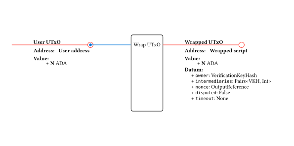
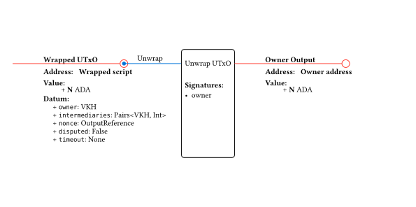
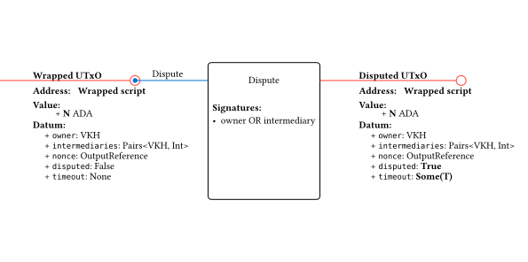
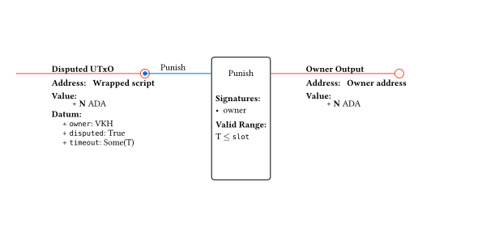
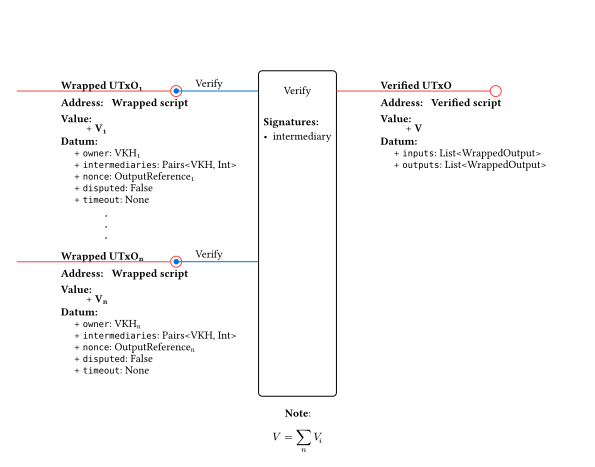
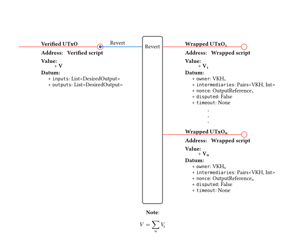
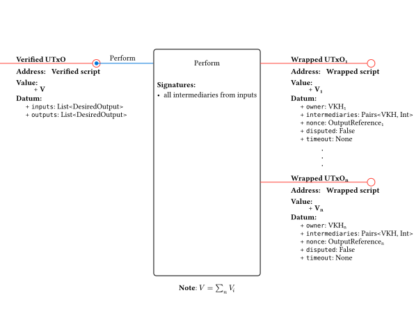

# Milestone 4

## Contract Design - Version 4

This new version of the contract modifies the `verify-perform` mechanism again, removing the token minting and consolidating reserved inputs into a single UTxO. To allow this operation to be reversed, the original inputs are stored in the inputs field of the `VerifiedDatum`. The outputs that need to be generated after the perform step are stored in the outputs field of the same datum.

Version 4 also introduces a **dispute mechanism** to prevent cross-ledger operations from getting stuck indefinitely. This is achieved by adding new redeemers (`Dispute`, `Merge`, `Punish`) and new datum fields (`disputed`, `timeout`, `nonce`) to the wrapped UTxO validator.

This way, if an intermediary stalls the protocol, any participant can **dispute** the wrapped UTxO. Once disputed in both replicas, the UTxOs can be **merged** on L1 (after head fanout) to recover the funds. If the counterparty does not cooperate with the merge, the disputer can **punish** them after the timeout, claiming all value including collateral.

### Wrapped UTxOs

L2 users send UTxOs to the Wrapped script address to make them available in the ad-hoc ledger.

* Address: Wrapped script
* Value: any
* Datum:
  * owner: VerificationKeyHash
  * intermediaries: Pairs\<VerificationKeyHash, Int\> (maps intermediary → their collateral share in lovelace)
  * nonce: OutputReference
  * disputed: Bool
  * timeout: Option\<Int\>

### Wrapped script

* Spend purpose redeemers:
  * Unwrap
  * Verify
  * Dispute
  * Merge
  * Punish

### Verified UTxOs

The verified validator stores the state of a verified transaction, including the inputs (for reverting) and outputs (for performing).

* Address: Verified script
* Value: the locked value
* Datum:
  * inputs: List\<WrappedOutput\> (for reverting to previous state)
  * outputs: List\<WrappedOutput\> (for performing the intended state change)

### Verified script

* Spend purpose redeemers:
  * Revert
  * Perform

### Operations overview

#### Wrap

Sends a user UTxO to the Wrapped script address. No on-chain validation is run during wrapping; the user simply pays to the script with an inline datum.

#### Unwrap

Consumes a Wrapped UTxO and sends the value back to the owner. Must be signed by the owner.

#### Dispute

Consumes a Wrapped UTxO with the `Dispute` redeemer. This marks the UTxO as disputed and sets a timeout. Either the owner or an intermediary can initiate the dispute.

The validator enforces:

* Signer is owner **or** an intermediary
* Datum fields `owner`, `intermediaries`, and `nonce` are preserved
* `disputed` is set to `True`
* `timeout` is set to `Some(T)`
* Value and address are preserved

#### Merge

Consumes **both** disputed replicas (same `nonce`) in a single transaction on L1 after the heads have been fanned out. This resolves the dispute by unwrapping the value to the owner and distributing collateral to intermediaries.

The validator enforces:

* The UTxO being spent is disputed (`disputed == True`)
* A replica input exists with the same `nonce` and same script address, and it is also disputed
* The first output sends the value to the owner's address
* Subsequent outputs distribute to intermediaries according to the `intermediaries` pairs

#### Punish

If the dispute timeout expires without a merge resolution, the owner can claim **all** value from the disputed UTxO, including collateral. This disincentivizes intermediaries from stalling indefinitely.

The validator enforces:

* The timeout has expired
* Signed by the owner

#### Verify

Consumes a Wrapped UTxO with the `Verify` redeemer and pays to the Verified contract. The verified datum stores both the original inputs and the intended outputs.

#### Revert

Consumes a Verified UTxO with the `Revert` redeemer and restores the original Wrapped UTxOs. Must be signed by the owner of one of the inputs.

#### Perform

Consumes a Verified UTxO with the `Perform` redeemer and produces the intended outputs as new Wrapped UTxOs.

