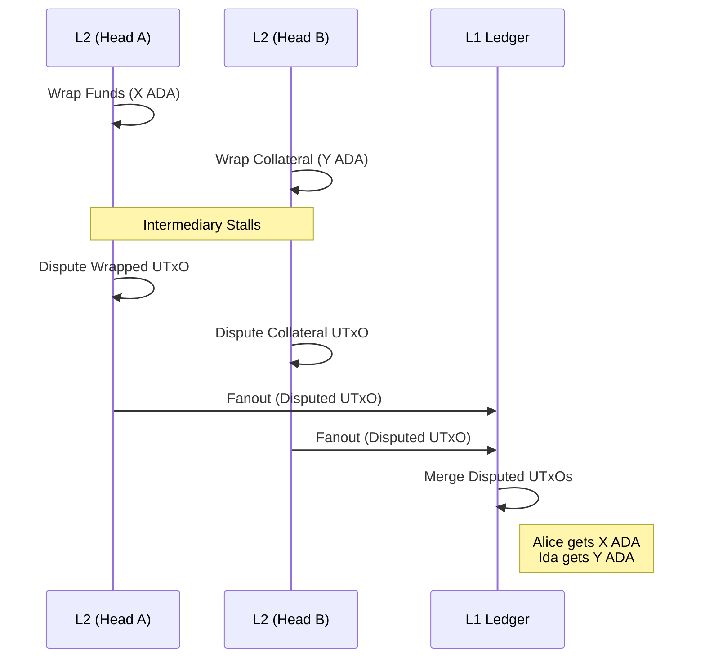
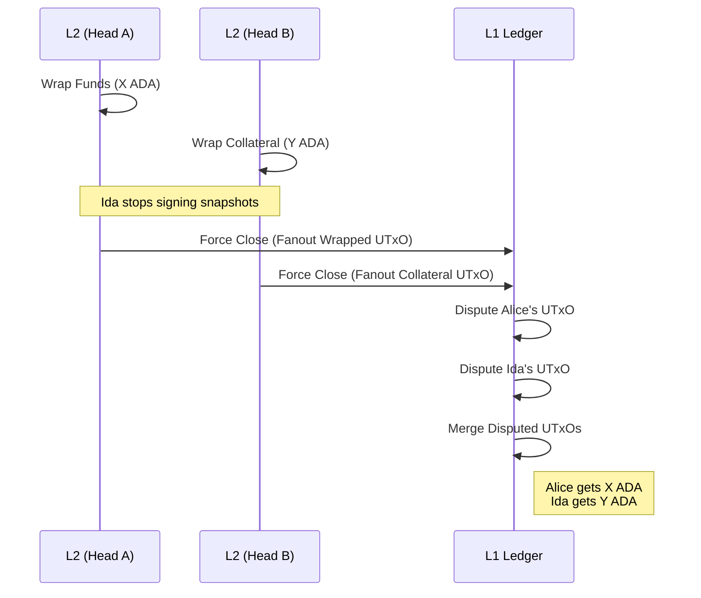

# Milestone 4

Consists of two parts:
1. Adversarial Scenarios
2. Ad-hoc ledger V4 specification

This milestone focuses on adversarial scenarios and implements the dispute mechanism to ensure that funds cannot get stuck indefinitely.

## Adversarial Scenarios

Adversarial scenarios occur when parties involved in a cross-ledger operation fail to cooperate. These situations are secured by two primary mechanisms: the on-chain smart contracts ensure that funds cannot be stolen or permanently locked, while the Hydra Head protocol ensures that progress is possible even if some participants become unresponsive.

An important aspect of these L2-to-L1 transitions is the **Hydra contestation period**. Before any disputed state can be settled on L1, the head must be closed and fanned out. This requires waiting for a contestation window, which in production environments may last for several days. Only after this period has elapsed can the final L1 transactions be submitted to resolve the dispute.

In this milestone, we consider two primary adversarial scenarios:

### Dispute in L2 and merge on L1

In this scenario, a party (e.g., an intermediary) ceases cooperation after funds have already been wrapped. The dispute is initiated within the L2 Hydra Head, but final resolution occurs on L1 after the head is closed.

1.  **Setup**: Alice wraps `X` ADA in Head A. Ida wraps collateral `Y` ADA in Head B. Both UTxOs share the same `nonce`.
2.  **Stall**: Ida stops responding (e.g., refusing to sign a `Verify` transaction).
3.  **Dispute (L2)**: Alice invokes the `Dispute` redeemer on her Wrapped UTxO within Head A. This marks the UTxO as disputed and starts an internal timeout.
4.  **Dispute (L2)**: Either Alice or Ida calls `Dispute` on the Collateral UTxO in Head B.
5.  **Fanout**: The Hydra heads are closed. After the contestation period expires, the disputed UTxOs are fanned out to the L1 ledger.
6.  **Merge (L1)**: On L1, the two fanned-out disputed UTxOs are spent together in a single `Merge` transaction.
    *   Alice recovers her original `X` ADA.
    *   Ida recovers her collateral `Y` ADA.

### Dispute and merge on L1

In this scenario, an intermediary stops signing Hydra snapshots entirely, effectively freezing the L2 head and preventing even L2 transactions like `Dispute`. The participants must force-close the heads, moving the dispute logic to L1.

1.  **Setup**: Alice wraps `X` ADA in Head A; Ida wraps collateral `Y` ADA in Head B.
2.  **Stall**: Ida refuses to sign new snapshots. Head A can no longer progress.
3.  **Fanout**: Participants close the heads. Once the contestation period ends, the Wrapped UTxOs fan out to L1 in their last valid state (non-disputed).
4.  **Dispute (L1)**: On L1, Alice calls `Dispute` on her fanned-out Wrapped UTxO.
5.  **Dispute (L1)**: Similarly, the Collateral UTxO is disputed on L1.
6.  **Merge (L1)**: Once both replicas are marked as disputed on L1, they are merged in a single transaction, refunding both parties.

### Midgard <> Hydra Scenarios

Scenarios involving Midgard follow a similar logic but benefit from different liveness guarantees. Unlike a Hydra Head, which can be stalled if a single participant stops signing, Midgard works by having multiple operators that take turns in a round-robin system validating transactions and modifying the ledger. 

If a specific operator refuses to validate transactions, the user simply waits for the next operator's shift to resubmit the transaction. This inherent robustness applies to both the `Dispute` transaction on L2 and the `Withdraw` event used to bridge UTxOs back to L1.

However, Midgard also imposes a delay: the **confirmation period**. Similar to Hydra's contestation period, Midgard requires a waiting period (which can last up to a week according to the specification) before an event is considered final and can be used on L1. Once this period passes, the rest of the L1 resolution flow (Dispute and Merge) remains identical to the Hydra scenarios described above.

## Contract Design - Version 4

> [!WARNING]
> This implementation is a **proof of concept** and should not be considered safe to use in it's current state

This new version of the contract modifies the `verify-perform` mechanism again, removing the token minting and consolidating reserved inputs into a single UTxO. To allow this operation to be reversed, the original inputs are stored in the inputs field of the `VerifiedDatum`. The outputs that need to be generated after the perform step are stored in the outputs field of the same datum.

Version 4 also introduces a **dispute mechanism** to prevent cross-ledger operations from getting stuck indefinitely. This is achieved by adding new redeemers (`Dispute`, `Merge`, `Punish`) and new datum fields (`disputed`, `timeout`, `nonce`) to the wrapped UTxO validator.

This way, if an intermediary stalls the protocol, any participant can **dispute** the wrapped UTxO. Once disputed in both replicas, the UTxOs can be **merged** on L1 (after head fanout) to recover the funds. If the counterparty does not cooperate with the merge, the disputer can **punish** them after the timeout, claiming all value including collateral.

### Wrapped UTxOs

L2 users send UTxOs to the Wrapped script address to make them available in the ad-hoc ledger.

* Address: Wrapped script
* Value: any
* Datum:
  * owner: VerificationKeyHash
  * intermediaries: Pairs\<VerificationKeyHash, Int\> (maps intermediary → their collateral share in lovelace)
  * nonce: OutputReference
  * disputed: Bool
  * timeout: Option\<Int\>

### Wrapped script

* Spend purpose redeemers:
  * Unwrap
  * Verify
  * Dispute
  * Merge
  * Punish

### Verified UTxOs

The verified validator stores the state of a verified transaction, including the inputs (for reverting) and outputs (for performing).

* Address: Verified script
* Value: the locked value
* Datum:
  * inputs: List\<WrappedOutput\> (for reverting to previous state)
  * outputs: List\<WrappedOutput\> (for performing the intended state change)

### Verified script

* Spend purpose redeemers:
  * Revert
  * Perform

### Operations overview

#### Wrap

Sends a user UTxO to the Wrapped script address. No on-chain validation is run during wrapping; the user simply pays to the script with an inline datum.

#### Unwrap

Consumes a Wrapped UTxO and sends the value back to the owner. Must be signed by the owner.

#### Dispute

Consumes a Wrapped UTxO with the `Dispute` redeemer. This marks the UTxO as disputed and sets a timeout. Either the owner or an intermediary can initiate the dispute.

The validator enforces:

* Signer is owner **or** an intermediary
* Datum fields `owner`, `intermediaries`, and `nonce` are preserved
* `disputed` is set to `True`
* `timeout` is set to `Some(T)`
* Value and address are preserved

#### Merge

Consumes **both** disputed replicas (same `nonce`) in a single transaction on L1 after the heads have been fanned out. This resolves the dispute by unwrapping the value to the owner and distributing collateral to intermediaries.

The validator enforces:

* The UTxO being spent is disputed (`disputed == True`)
* A replica input exists with the same `nonce` and same script address, and it is also disputed
* The first output sends the value to the owner's address
* Subsequent outputs distribute to intermediaries according to the `intermediaries` pairs

#### Punish

If the dispute timeout expires without a merge resolution, the owner can claim **all** value from the disputed UTxO, including collateral. This disincentivizes intermediaries from stalling indefinitely.

The validator enforces:

* The timeout has expired
* Signed by the owner

#### Verify

Consumes a Wrapped UTxO with the `Verify` redeemer and pays to the Verified contract. The verified datum stores both the original inputs and the intended outputs.

#### Revert

Consumes a Verified UTxO with the `Revert` redeemer and restores the original Wrapped UTxOs. Must be signed by the owner of one of the inputs.

#### Perform

Consumes a Verified UTxO with the `Perform` redeemer and produces the intended outputs as new Wrapped UTxOs.

