# Milestone 5

Consists of two parts:

1. Lottery contract specification
2. Topology description

This final milestone demonstrates a non-trivial use case where smart contracts deployed across multiple L2s interact seamlessly. Users participate in a lottery contract running on a different head by locking assets, submitting entries, and receiving results through cross-ledger interaction. This proves the feasibility of building multi-L2 dApps.

## Lottery Contract Specification

The lottery contract `lottery.ak` implements the entire lifecycle of a decentralized lottery. Admin creates the lottery with a predefined prize and ticket cost. Users can purchase tickets by specifying the lottery ID and locking funds in a ticket validator. The winner selection is deferred offchain and passed by redeemer to the lottery UTxO.

### Lottery UTxOs

The lottery validator stores the state of the lottery, including the prize, ticket cost, and whether it has been completed. Each lottery has an NFT that uniquely identifies it. A single ticket wins the whole prize and the winner needs to be paid before collecting the losing tickets.

* Address: Lottery script
* Value:
  * Prize
  * Lottery NFT
* Datum:
  * admin: VerificationKeyHash (the creator and manager of the lottery)
  * prize: Int (the amount of lovelace the winner will receive)
  * ticket_cost: Int (the cost in lovelace for a single ticket)
  * close_timestamp: Int (the time after which the lottery concludes and no more tickets can win)
  * paid_winner: Bool (whether the prize has been distributed)

### Lottery script

* Spend purpose redeemers:
  * PayWinner
  * Close
* Mint purpose redeemers:
  * Mint
  * Burn

### Ticket UTxOs

Users send UTxOs to the Ticket script address to purchase an entry into the lottery. Each ticket has a desired output where the winnings are paid.

* Address: Ticket script
* Value: The ticket cost (in lovelace)
* Datum:
  * lottery_id: ByteArray (the TokenName of the lottery NFT they are playing)
  * desired_output: DesiredOutput (the address and optional datum to send the prize to if this ticket wins)

### Ticket script

* Spend purpose redeemers:
  * Win
  * Lose

### Mint Lottery

The admin creates the Lottery by minting an NFT and initializing the Lottery UTxO.

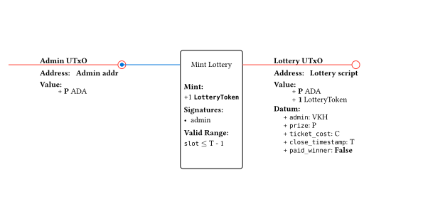

### Buy Ticket

Users lock funds in the `Ticket` validator to participate.

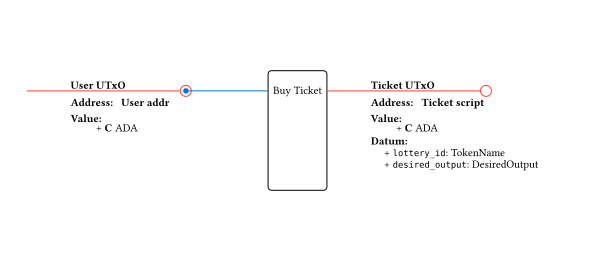

### Pay Winner

The admin collects the winning ticket and pays out the prize. Needs to be executed after the lottery close timestamp.

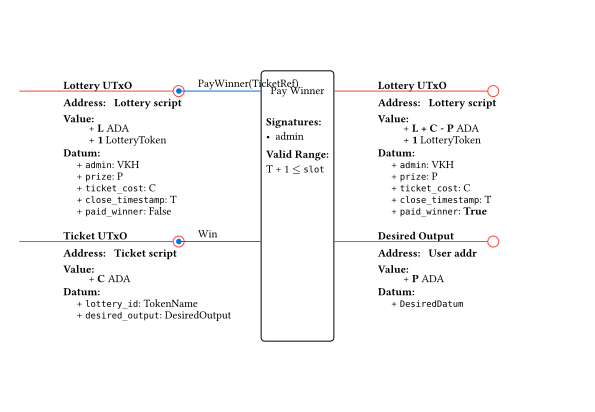

### Collect Losing Tickets

The admin reclaims funds from losing tickets using a reference to the paid out Lottery UTxO.

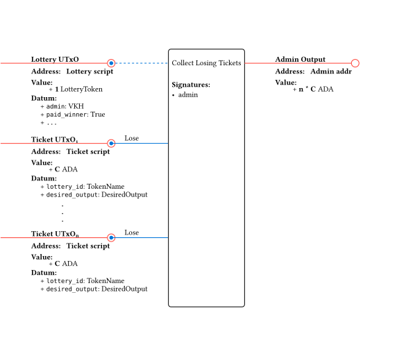

### Close Lottery

After paying the winner and collecting the desired funds, the admin burns the Lottery NFT to close the application.

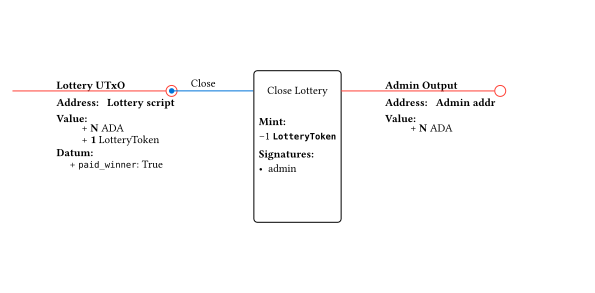

## Demo Topology

The final demo topology consists of three distinct Hydra heads, designed to illustrate different participation models and cross-L2 interactions:

1. **Main Head (Lottery Head):** This head is operated by Bob, Ida, and Jon, and serves as the execution environment for the lottery smart contract. This setup involves multiple parties to represent that this head could be substituted with another Layer 2 solution utilizing a different consensus mechanism, such as Midgard.

2. **Custodial Head (Head A):** Managed by Alice and Ida, this two-party head acts as a custodial environment. Alice operates it as a faucet, distributing funds to users. This model allows users to participate in the ecosystem and maintain control over their distributed funds without the technical overhead of running their own individual Hydra nodes.

3. **Non-Custodial Head:** This two-party head is established between Charli and Ida. It is included to demonstrate a non-custodial interaction model, allowing Charli to directly participate in the lottery without relying on a custodial intermediary. This showcases the versatility of the architecture in supporting direct, self-managed user participation.

## Demo walkthrough

Here's the step by step walkthrough of the demo:

### Step 1

This is the initial state of the demo topology. In head A, Alice has 10k ADA, ready to distribute to users, in head B, Bob has 2k ADA which he will use as the prize for the lottery, and in head C, Charlie has 5k ADA. Ida will work as an intermediary.

> [!Info]
> Notice that Ida needs at least 2k ADA in both head A and C to cover the transfer of the winning ticket, this is discussed in the [liquidity requirements section of ms3](../ms3/README.md#hub-and-spoke). Notice how we also have some extra liquidity in head B because we expect the most volume moving into this head.

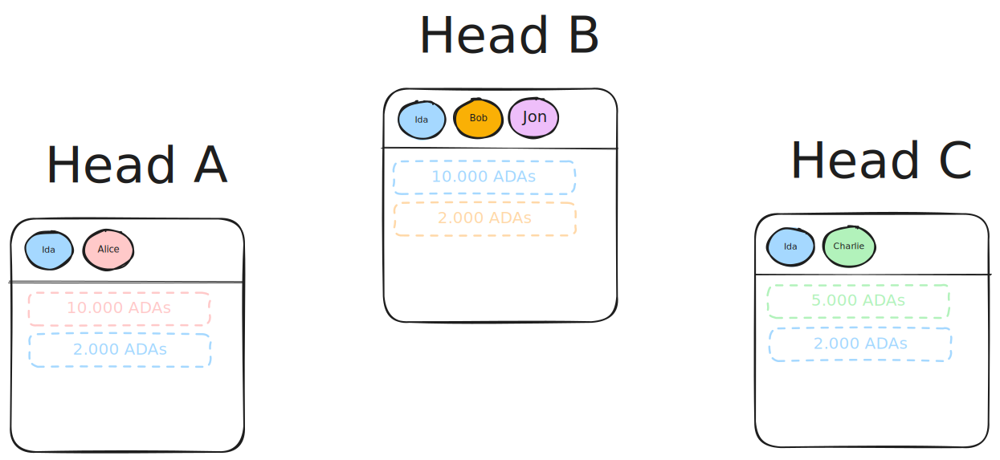

### Step 2

The second step is for Bob to create the lottery. He does this by minting the lottery NFT and creating the lottery UTxO, where he locks the prize (in this case, 2k ADA).

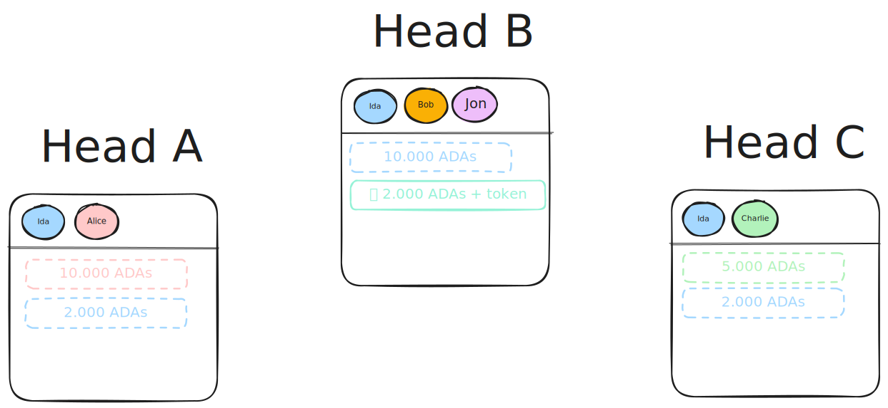

### Step 3

Now that the lottery is initialized, users can use the system. They first connect their wallet to our UI and request funds from the faucet (Alice).

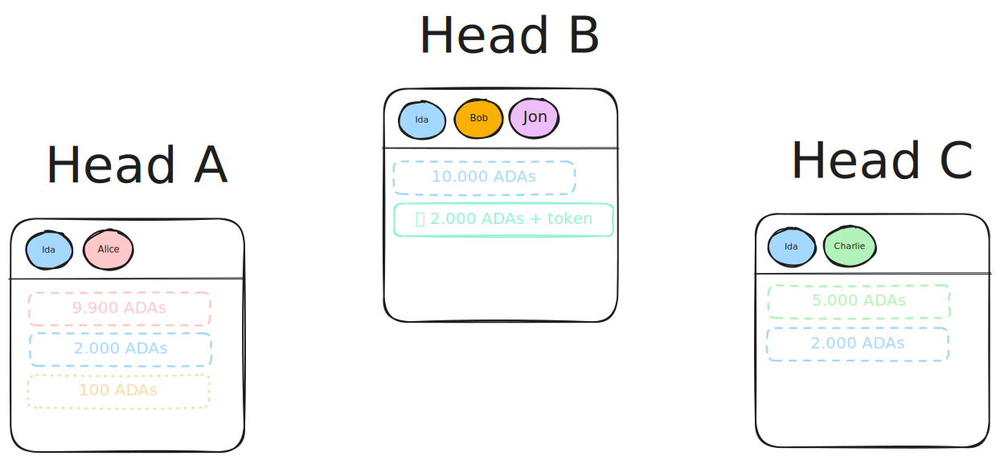

### Step 4

With those 100 ADA, a user locks them in an HTLC in head A, specifying the desired output as the ticket script address, with all the lottery details, and a secret generated by Bob.

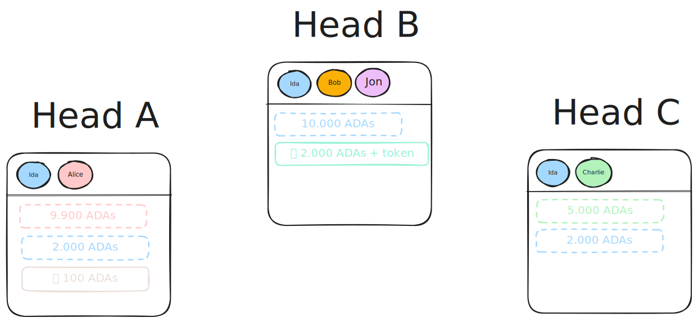

### Step 5

Ida recreates the HTLC in head B, and once Bob claims, Ida can do so in head A. The end result is the ticket being correctly purchased in head B, by a user that had funds in head A, and Ida's funds have "shifted" from head B to head A.

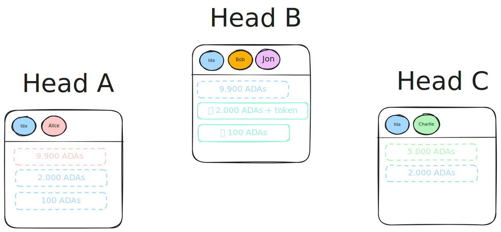

### Step 6

Charlie can do the same on head C. After doing so, and after a new user registers in head A and buys the ticket, the state of the system looks like this. Three tickets are purchased in head B, funded by Ida, and Ida has received those funds back in heads A and C.

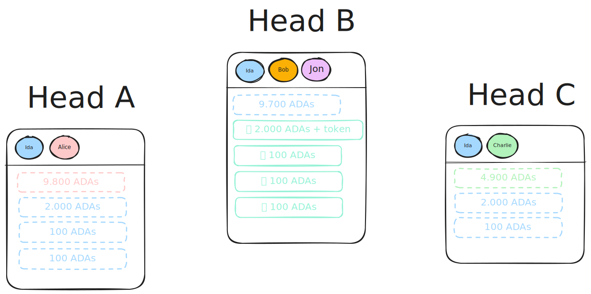

### Step 7

Once the timeout runs out, Bob is ready to pay the lottery winner. He does so by sending the prize to the output specified in the ticket UTxO, which in this case is an HTLC output going back to head A.

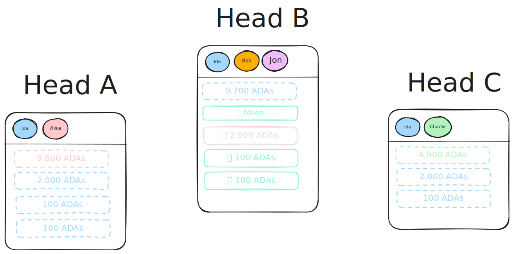

### Step 8

Ida uses their funds in head A to recreate the HTLC.

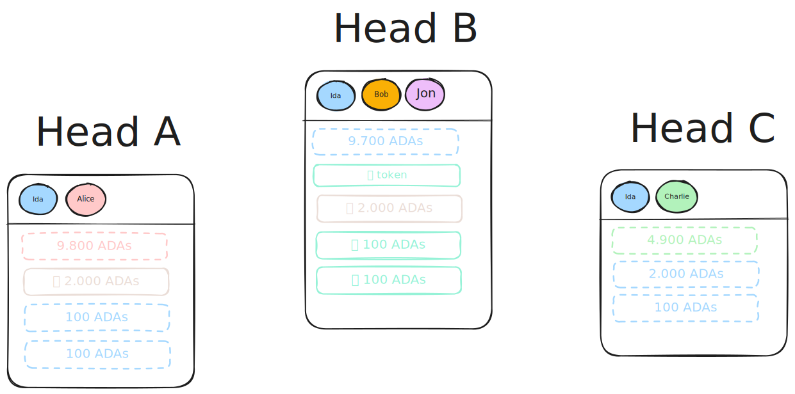

### Step 9

After Alice claims, Ida can do the same in head B, and finally, the winner has received their prize.

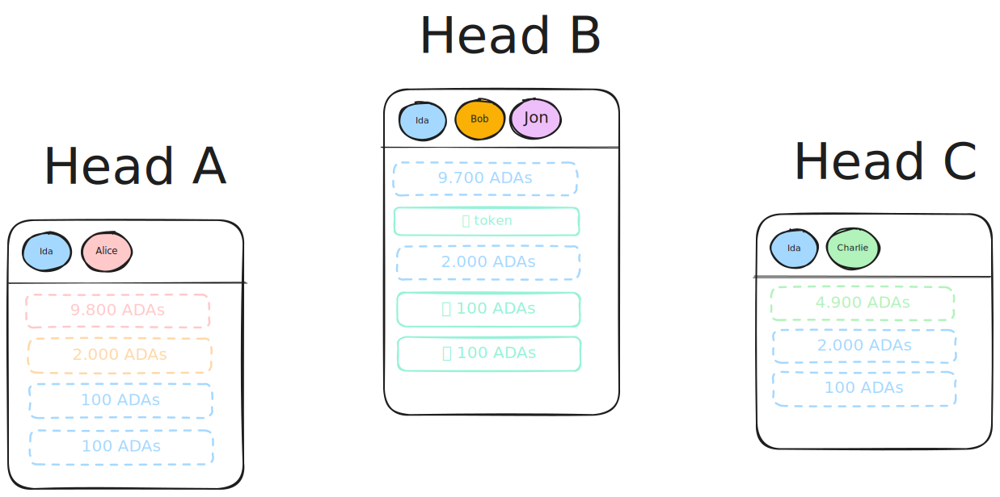

### Step 10

Finally, Bob collects the losing tickets and closes the lottery. The fund distribution at the end looks like this.

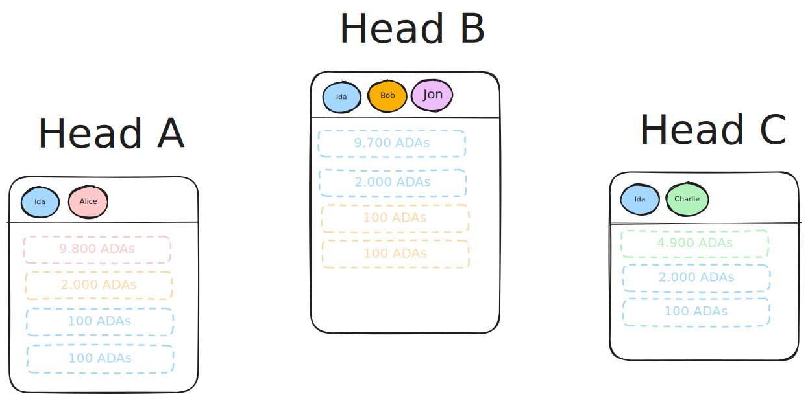