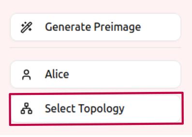
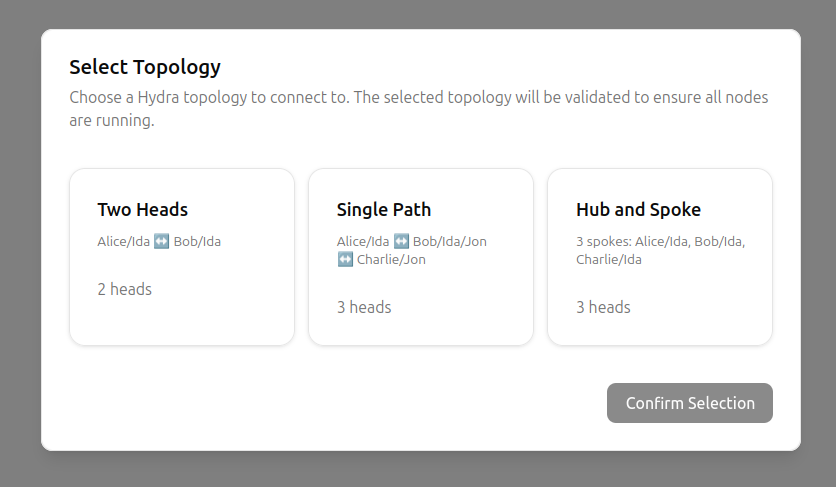

# HTLC Multihead Topologies Demo

Next.js client application for interacting with Hydra Multihead Topologies.

This UI allows to select between different topologies and make payments across multiple heads.

## Setup

Install client dependencies

```bash
npm install
```

Before running the development server, you need to start the Hydra nodes.
```bash
cd ../infra
docker compose -f docker-compose.$TOPOLOGY.yaml up
```
where $TOPOLOGY is the topology you want to use. One of:
- two-heads
- single-path
- hub-and-spoke

## Development

```bash
npm run dev
```

Open [http://localhost:3000](http://localhost:3000).

Open the topology selector to select the topology you run the nodes for






## Features

- Select the topology you want to use
- Select the user you want to use
- Make payments across heads, the payment path is selected automatically based on the topology you selected
- View the UTxO set of each head
- Track payment progress and status real-time in the sidebar
