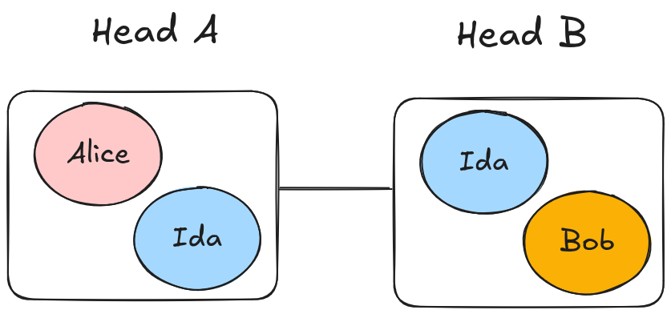
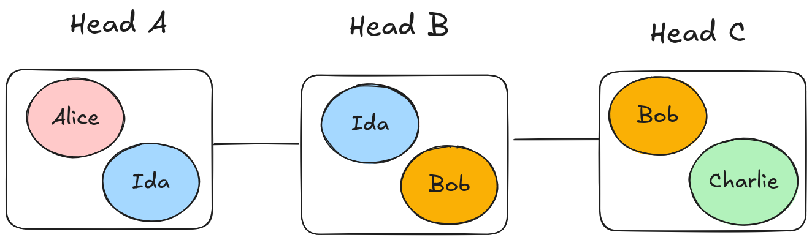
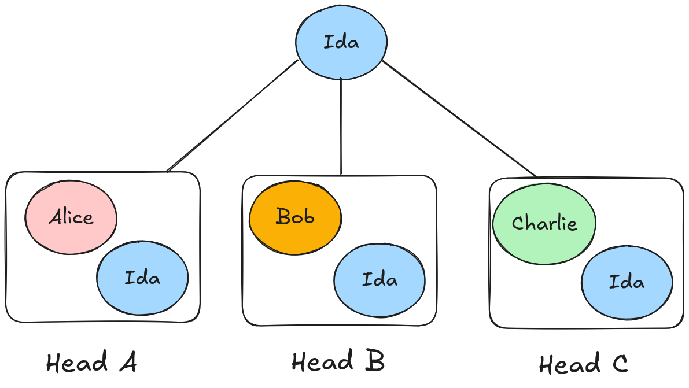

# Infrastructure

This directory contains the infrastructure for the EUTxO L2 Interoperability project.

## Usage

To start the infrastructure with the simplest topology: only two heads, run:

```bash
docker compose -f docker-compose.two-heads.yaml up
```



To start the infrastructure with the single-path topology: 3 heads in a chain, run:

```bash
docker compose -f docker-compose.single-path.yaml up
```



To start the infrastructure with the hub-and-spoke topology: 3 heads, with Ida acting as hub for the other nodes, run:

```bash
docker compose -f docker-compose.hub-and-spoke.yaml up
```



## Topologies Explanation

### Two-heads topology

The two-heads topology is the simplest topology, it consists of two heads, each with two participants.

The use case for this topology is HTLC-based payments between two parties from different heads, with some party acting as intermediary (present in both heads) i.e. single hop payment.

### Single-path topology

The single-path topology is a topology where three heads are connected in a chain, two participants each except for the middle head which has three participants.

The use case for this topology is HTLC-based payments between two parties from different heads, by potentially needing multiple hops.

### Hub-and-spoke topology

The hub-and-spoke topology is a topology where the heads are connected in a hub and spoke pattern, with Ida acting as hub for the other nodes.

The use case for this topology is HTLC-based payments between two parties from different heads using two hops, with Ida acting as intermediary by being present in all heads.

## Port numbering schema

To maintain certain order and avoid clashes, the port number and ipv4 of each hydra node is defined as per the following schema:

* api-port: `4XYZ`
* ws-port: `5XYZ`
* monitoring-port: `6XYZ`
* ipv4 address: `171.16.238.XYZ` (`171.16.238.YZ` if X = 0)

where

```md
X = TopologyId (zero indexed)
Y = HeadId (A1Z26 encoded)
Z = UserId (A1Z26 encoded)
```

---

### Topology IDs

| Two-heads | Single-path | Hub-and-spoke |
|-----------|-------------|---------------|
| 0         | 1           | 2             |

---

### Head IDs (A1Z26)

| A | B | C |
|---|---|---|
| 1 | 2 | 3 |

---

### User IDs (A1Z26)

| Alice | Bob | Charli | Jon | Ida |
|-------|-----|--------|-----|-----|
| 1     | 2   | 3      | 8   | 9   |

---

### Example

```ascii
Two-heads topology────┐
                      │ ┌───User Bob
                      │ │
                      ▼ ▼
                     4022
                     ▲ ▲
                     │ │
            API-port─┘ └───Head B
```
